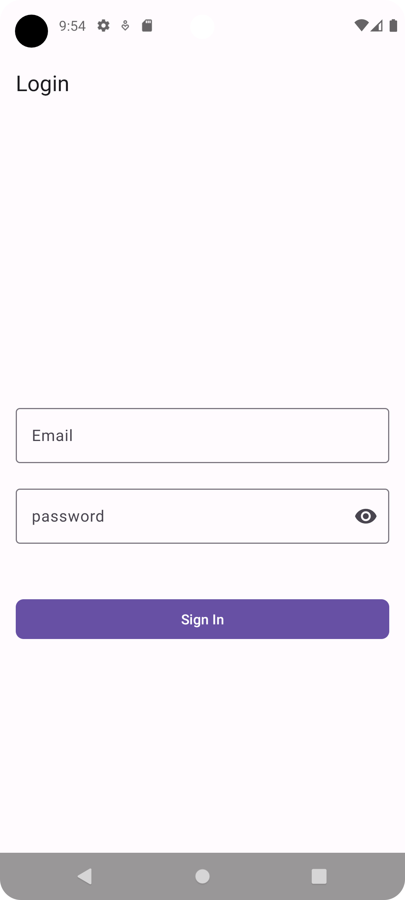
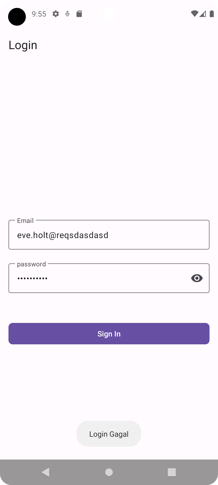
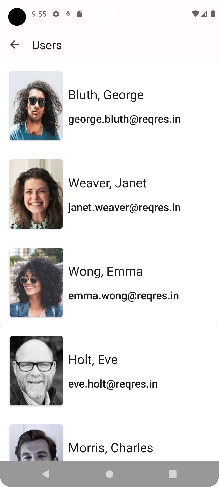

# User Catalog App

A User Catalog for Android, build using Kotlin & XML

# Feature
- Login
- User List Screen

# Screenshoot

    
    
    

# Tech Stack

- Kotlin
- XML
- Jetpack Navigation
- Material Design 3
- Coroutine
- Kotlin Flows
- Paging 3
- Coil
- Hilt
- Datastore
- Ktor Client
- MVVM
